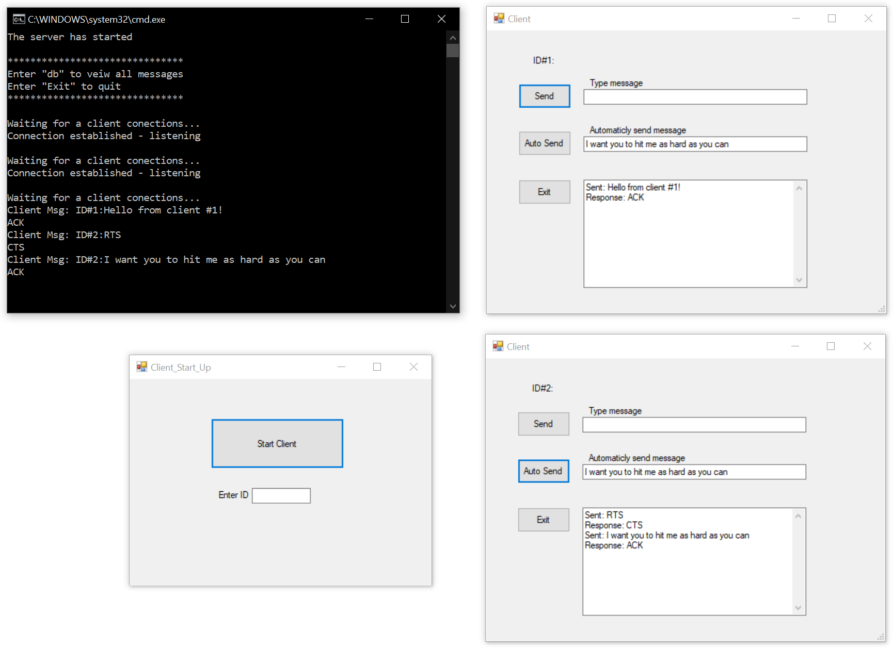

# Custom_BaseStationEmulator
 I created this base station emulator for my NETWORKS/DATA COMM II class. The emulator has a server and client/clients which utilize .NET's TcpListener, Tcpclient and Thread class.

## Motivation
I started from scratch instead of adding to a codebase created by the professor in order to get a better understanding of the project. 

## Requirments 
- Create a TCP listener that "listens” on a particular port for TCP client requests (Server)
- Create a client program to communicate with the Server and receive responses back
- Create a simulated/automatic message exchange (Client sends RTS message, Server sends a CTS in response, Client sends a custom message, Server sends an ACK in response)
- Give the server the ability to store messages received

## Result
